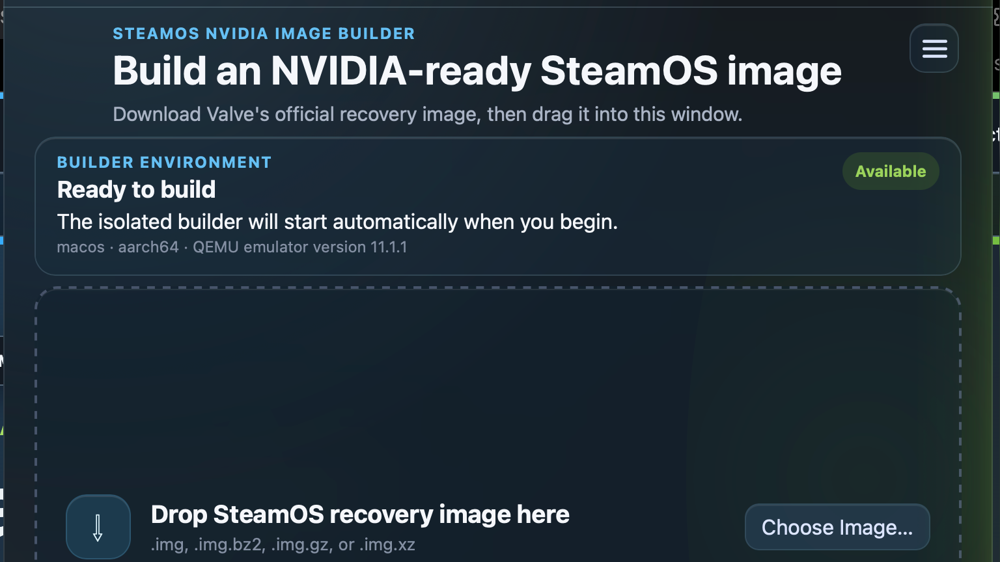
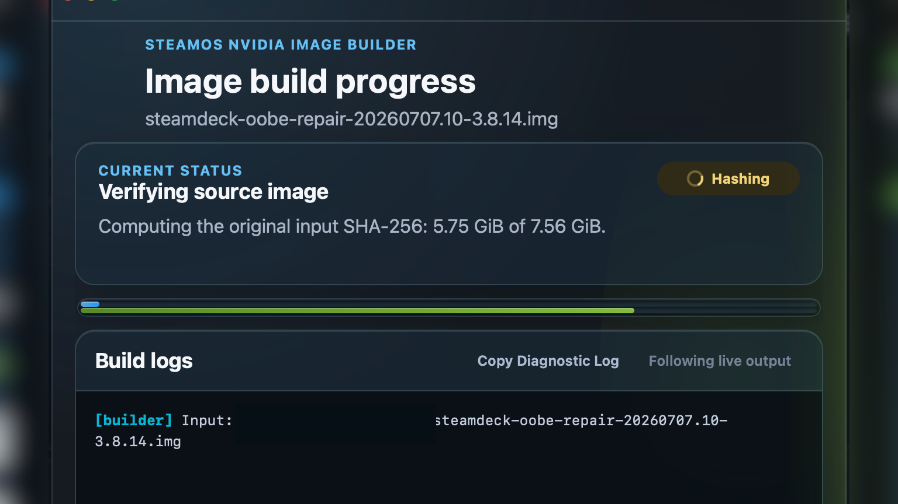

<p align="center">
  
</p>

<h1 align="center">OPEMOS.EXE</h1>

<p align="center"><strong>Desktop image building for exact-kernel NVIDIA on SteamOS.</strong></p>

<p align="center">
  <a href="https://github.com/CorniiDog/OPEMOS.EXE/actions/workflows/checks.yml"></a>
  <a href="https://github.com/CorniiDog/OPEMOS.EXE/actions/workflows/pages.yml"></a>
  <a href="LICENSE"></a>
</p>

OPEMOS.EXE is the desktop SteamOS NVIDIA Image Builder. It takes an official
Valve recovery image, performs exact-kernel NVIDIA resolution and installation
inside managed Fedora appliances, independently validates the result, and
exports a separate image, a removable USB target, or both.

Newly generated media also includes **Open OPEMOS**, an automatically launched
full-screen installation-media welcome application. It makes the destination disk an
explicit choice, keeps fresh install and reinstall distinct, and revalidates
the exact physical device before delegating to Valve's installer. After Valve
finishes, it stages the pinned OPEMOS recovery guardian into both installed A/B
slots so delayed-network repair remains available after the USB is removed.

The original recovery image is opened read-only and is never redistributed by
this project.

Preview the installation-media welcome flow safely on macOS, Linux, or Windows with:

```bash
./test_welcome_macos.sh
./test_welcome_linux.sh
pwsh -File .\test_welcome_windows.ps1
```

The preview uses synthetic disks and mocked progress only. It never requests
privileges, inspects storage, starts QEMU, or invokes the real installer.

> OPEMOS.EXE is active development software. NVIDIA image mutation has passed
> structural validation, but Valve installer propagation, A/B update behavior,
> and physical NVIDIA hardware boot are still separate certification gates.

## Screenshots

| Main workflow | Build progress |
| --- | --- |
|  |  |

The documentation site includes full 16:9 captures of the main workflow,
progress window, and permission-gated maintainer workspace.

## Start here

- [Documentation home](https://corniidog.github.io/OPEMOS.EXE/)
- [Getting started](docs/getting-started.md)
- [Build workflow](docs/workflow.md)
- [Developer guide](docs/developer-guide.md)
- [Architecture and trust boundaries](docs/architecture.md)
- [Hardware and update recovery](docs/hardware-and-updates.md)
- [Stable graphical shell and backend updates](docs/hardware-and-updates.md#stable-shell-updateable-services)
- [Security model](docs/security.md)
- [Troubleshooting](docs/troubleshooting.md)
- [Roadmap](TODO.md)

## Current host support

| Host | Development and validation status |
| --- | --- |
| Apple Silicon macOS | Primary development and tested host; signed distribution remains a separate release gate |
| Intel macOS | Supported architecture path; broader hardware testing remains pending |
| x86_64 Ubuntu/Linux | Experimental desktop host with explicit KVM or TCG selection; debug unsigned DEB/AppImage output only |
| Debian 12 x86_64 | Experimental pinned packaging target; debug unsigned package validation only |
| Windows x86_64 | Native development and unsigned portable builds are supported; physical USB writes remain unavailable outside the contained owned-virtual-USB harness |

The first reviewed target is SteamOS 3.8.14, kernel
`6.16.12-valve24.4-1-neptune-616-gfe145653a794`, and NVIDIA `575.64.05`.
No closest-kernel substitution is permitted.

## Develop on macOS

```bash
git clone https://github.com/CorniiDog/OPEMOS.EXE.git
cd OPEMOS.EXE
./cargodev_init_macos.sh
npm ci
npm run test:all
./test_welcome_macos.sh
```

The bootstrap checks or installs Homebrew dependencies and launches Tauri.
Prepare the managed x86_64 worker on Apple Silicon with
`./builder/appliance/build_macos.sh --architecture x86_64`. Live appliance,
network, packaging, and raw-device tests remain separately gated.

## Develop and test on Linux

Use an x86_64 Ubuntu or Debian graphical host with Node.js/npm, Rust/Cargo,
Python 3, Git, curl, OpenSSH, QEMU (`qemu-system-x86_64` and `qemu-img`), GnuPG,
7-Zip, and the distribution's Tauri/WebKitGTK build packages.

```bash
./cargodev_init_linux.sh --check
./cargodev_init_linux.sh --print-only
npm ci
OPEMOS_EXPERIMENTAL_LINUX=1 OPEMOS_LINUX_ACCEL=kvm npm run dev:linux-test
OPEMOS_EXPERIMENTAL_LINUX=1 OPEMOS_LINUX_ACCEL=tcg npm run build:linux-test
OPEMOS_EXPERIMENTAL_LINUX=1 OPEMOS_LINUX_ACCEL=tcg npm run build:debian12-test
npm run test:package-linux
./test_welcome_linux.sh
```

Linux bundles are unsigned debug artifacts under
`src-tauri/target/debug/bundle/deb/` and
`src-tauri/target/debug/bundle/appimage/`. KVM and TCG must be selected
explicitly; there is no automatic fallback. This path remains experimental,
and real networking, appliance lifecycle, removable-media writes, installer
propagation, and physical NVIDIA boot require their separately named gates.

## Develop and build on Windows

Use x86_64 Windows with PowerShell 7, Node.js 22.23.2, Rust 1.98.1, Git, Python, QEMU, GnuPG,
WebView2 Runtime, and Visual Studio C++ Build Tools. These commands match the
locked checks and release build in `.github/workflows/windows-portable.yml`:

```powershell
pwsh -File .\cargodev_init_windows.ps1 -CheckOnly
pwsh -File .\cargodev_init_windows.ps1 -PrintOnly
npm ci
cargo test --manifest-path src-tauri/Cargo.toml --locked windows_
cargo build --manifest-path src-tauri/Cargo.toml --release --locked
pwsh -File .\test_welcome_windows.ps1
```

The unsigned portable executable is
`src-tauri/target/release/steamos-nvidia-image-builder.exe`. Contained Windows
validation installs and seals Windows once, preserves that immutable base, and
uses a disposable overlay for every normal build or test run. The executable
is currently unsigned. Physical USB writing remains unavailable; only an
exactly owned 32 GiB virtual USB may be used by the separately gated harness,
and short tests are never end-to-end evidence.

## Repository boundaries

The authoritative cross-project ownership contract is
[`BOUNDARIES.md`](BOUNDARIES.md). Repository summaries are non-authoritative.

| Repository | Responsibility |
| --- | --- |
| [`OPEMOS.EXE`](https://github.com/CorniiDog/OPEMOS.EXE) | Host image builder, recovery-image inspection, QEMU lifecycle, safe export/USB workflow, independent validation, and the welcome/installer UI embedded in bootable media |
| [`OPEMOS`](https://github.com/CorniiDog/OPEMOS) | Exact NVIDIA artifact resolution, builds, userspace locks, offline installation, provenance/publication, the installed-system update guardian, and the persistent target-device Desktop UI |
| [`open-gpu-kernel-modules-steamos`](https://github.com/CorniiDog/open-gpu-kernel-modules-steamos) | Versioned project NVIDIA source branches and SteamOS-specific patches |

## Safety summary

- The selected recovery image is attached read-only.
- Mutation occurs only in a disposable qcow2 overlay.
- NVIDIA artifacts require exact kernel, architecture, vermagic, hashes, and
  authenticated provenance.
- Userspace packages require reviewed locks, detached signatures, and an exact
  dependency closure.
- Failed or cancelled overlays are discarded and never receive the final
  NVIDIA image name.
- The GUI never runs as root. macOS USB writing uses a narrowly authorized raw
  device descriptor and revalidates the target immediately before destruction.
- The installation-media welcome UI also remains unprivileged. Its protected
  helper accepts only fixed install modes, excludes the booted media, binds the
  selection to a device-identity digest, and checks that identity again before
  invoking a root-owned compatible Valve installer delegate.
- Human-readable logs are diagnostic only; machine-readable contracts decide
  success.

## Licensing and trademarks

Project source is available under the [MIT License](LICENSE). Third-party
runtime components retain their own licenses and distribution terms.

SteamOS, Steam Deck, and Steam are trademarks of Valve Corporation. NVIDIA and
related marks are trademarks of NVIDIA Corporation. This unofficial community
project is not affiliated with, endorsed by, or supported by Valve or NVIDIA.
